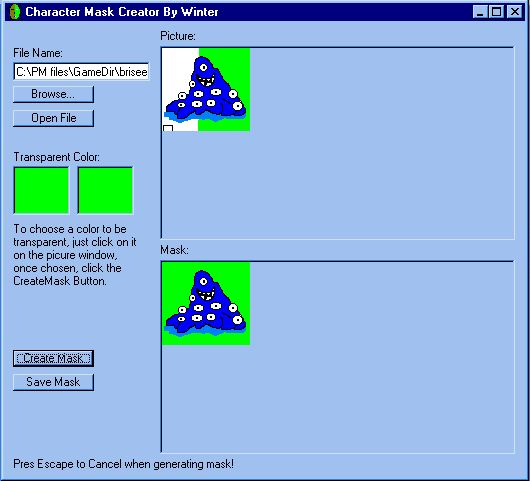



## A Generator of bitmaps to create masks in games with BitBlt function

### Description

It takes the bitmap given and makes a color chosen transparent by turning it vbWhite so you can use the constant vbSrcAnd of the BitBlt function. Then creates a new bitmap to use it as mask with the constant vbMergePaint of the BitBlt function
 
### More Info
 

             |
---                |---
**Submitted On**   |2000-12-21 21:50:56
**By**             |[Paul Monge](https://github.com/Planet-Source-Code/PSCIndex/blob/master/ByAuthor/paul-monge.md)
**Level**          |Intermediate
**User Rating**    |4.4 (22 globes from 5 users)
**Compatibility**  |VB 6\.0
**Category**       |[Games](https://github.com/Planet-Source-Code/PSCIndex/blob/master/ByCategory/games__1-38.md)
**World**          |[Visual Basic](https://github.com/Planet-Source-Code/PSCIndex/blob/master/ByWorld/visual-basic.md)
**Archive File**   |[CODE\_UPLOAD1292512222000\.zip](https://github.com/Planet-Source-Code/paul-monge-a-generator-of-bitmaps-to-create-masks-in-games-with-bitblt-function__1-13780/archive/master.zip)

